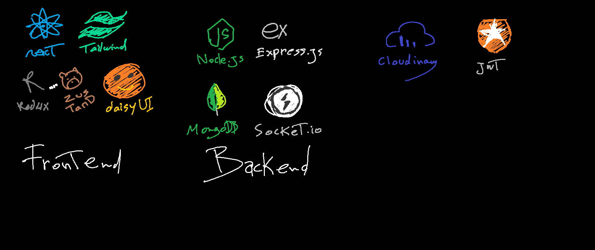
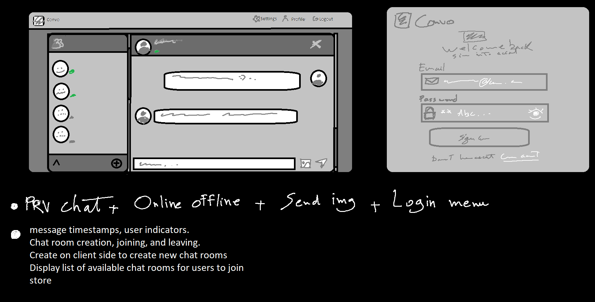

# Convo Chat App
An instant messaging and social platform which allows communication through text messaging and media.

## Project Planning
this is how i planned and designed in preps

*This diagram shows the intended tech stack and architecture, including all major frontend and backend technologies, real-time communication, and cloud services.*

## 🎨 UI/UX Design Plan
The following sketch illustrates the initial UI/UX design and feature planning for the chat app:

*This is the planned user interface, chat layout, login flow, and key features such as private chat, online/offline status, and chat room management.*

## Highlights

- Tech stack: MERN + Socket.io + TailwindCSS + Daisy UI + Headless UI
- Authentication && Authorization with JWT
- Real-time messaging private one to one and room chat with Socket.io
- Online user status and time stamps
- Global state management with Zustand
- Error handling both on the server and on the client
- And much more!

